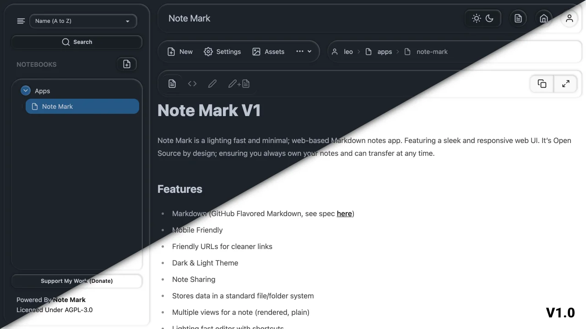

# Note Mark

Note Mark is a lighting fast and minimal; web-based Markdown notes app. Featuring a sleek and responsive web UI.

## Features
- Markdown (GitHub Flavored Markdown, see spec [here](https://github.github.com/gfm/))
- HTML sanitisation, minimizing XSS attacks
- Mobile Friendly
- Friendly URLs for cleaner links
- Dark & Light Theme
- Notebook Sharing
- Custom flat-file based storage system
- Multiple views for a note (rendered, plain)
- Lighting fast editor with shortcuts
- Upload and attach assets
- OIDC support for Single-Sign-On

## Showcase

## Demo Video

<https://youtu.be/rwL99Ac5g98>

## Docs
Documentation is available here: [notemark.docs.enchantedcode.co.uk](https://notemark.docs.enchantedcode.co.uk/).

> Checkout the [roadmap here](https://github.com/users/enchant97/projects/7).

## Support Me
Like this project? Consider supporting me financially so I can continue development.

> Please note I currently do not accept paid incentives for features.

## License
This project is Copyright (c) 2024 Leo Spratt, licences shown below:

Code

    AGPL-3.0. Full license found in `LICENSE.txt`

Icon / Mark

    All Rights Reserved
